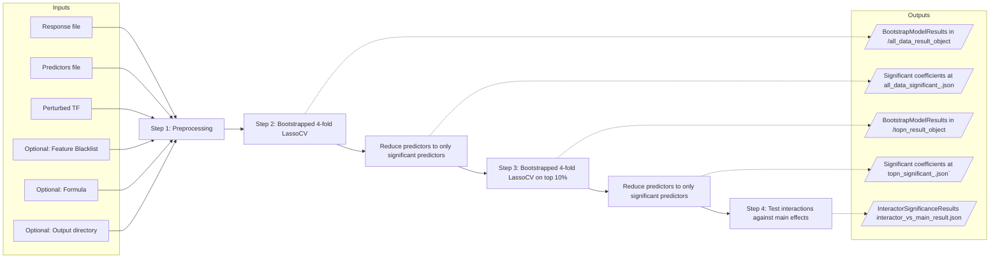
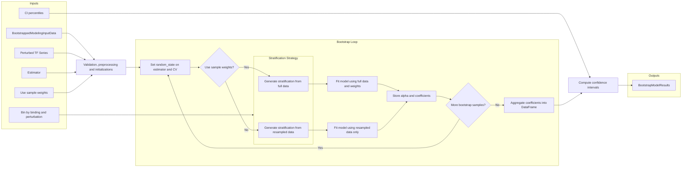

```mermaid
graph LR;
    %% Inputs
    subgraph Inputs
        IN1[Response file]
        IN2[Predictors file]
        IN3[Perturbed TF]
        IN4[Optional: Feature Blacklist]
        IN5[Optional: Formula]
        IN6[Optional: Output directory]
    end

    %% Inputs to Validation
    IN1 --> A
    IN2 --> A
    IN3 --> A
    IN4 --> A
    IN5 --> A
    IN6 --> A

    %% Data flow
    A[Step 1: Preprocessing] --> B[Step 2: Bootstrapped 4-fold LassoCV]
    B --> C[Reduce predictors to only significant predictors]
    C --> D[Step 3: Bootstrapped 4-fold LassoCV on top 10%]
    D --> E[Reduce predictors to only significant predictors]
    E --> F[Step 4: Test interactions against main effects]

    %% Outputs
    subgraph Outputs
        OUT1@{ shape: lean-r, label: "BootstrapModelResults in /all_data_result_object" }
        OUT2@{ shape: lean-r, label: "Significant coefficients at all_data_significant_<ci_level>.json" }
        OUT3@{ shape: lean-r, label: "BootstrapModelResults in /topn_result_object" }
        OUT4@{ shape: lean-r, label: "Significant coefficients at topn_significant_<ci_level>.json`" }
        OUT5@{ shape: lean-r, label: "InteractorSignificanceResults interactor_vs_main_result.json" }
    end

    %% Linking Outputs to Process
    B -.-> OUT1
    C -.-> OUT2
    D -.-> OUT3
    E -.-> OUT4
    F -.-> OUT5
```

```mermaid
graph LR;

    %% Inputs
    subgraph Inputs
        IN1[BootstrappedModelingInputData]
        IN2[Perturbed TF Series]
        IN3[Estimator]
        IN4[CI percentiles]
        IN5[Use sample weights]
        IN6[Bin by binding and perturbation]
    end

    %% Input routing
    IN1 --> A[Validation, preprocessing and initializations]
    IN2 --> A
    IN3 --> A
    IN4 --> N[Compute confidence intervals]
    IN5 --> A
    IN6 --> SS

    %% Bootstrap Loop
    A --> C[Set random_state on estimator and CV]

    subgraph "Bootstrap Loop"
        C --> D{Use sample weights?}

        %% Stratification strategy section (wrapped visually)
        subgraph SS[Stratification Strategy]
            direction TB
            E1[Generate stratification from full data]
            E2[Generate stratification from resampled data]
        end

        D -- Yes --> E1
        D -- No  --> E2

        E1 --> F1[Fit model using full data and weights]
        E2 --> F2[Fit model using resampled data only]

        F1 --> G[Store alpha and coefficients]
        F2 --> G
        G --> H{More bootstrap samples?}
        H -- Yes --> C
        H -- No --> I[Aggregate coefficients into DataFrame]
    end

    I --> N

    %% Outputs
    subgraph Outputs
        OUT1[BootstrapModelResults]
    end

    N --> OUT1
```